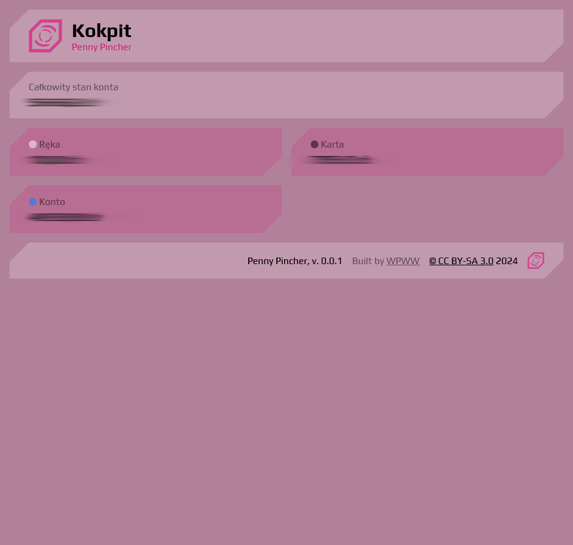
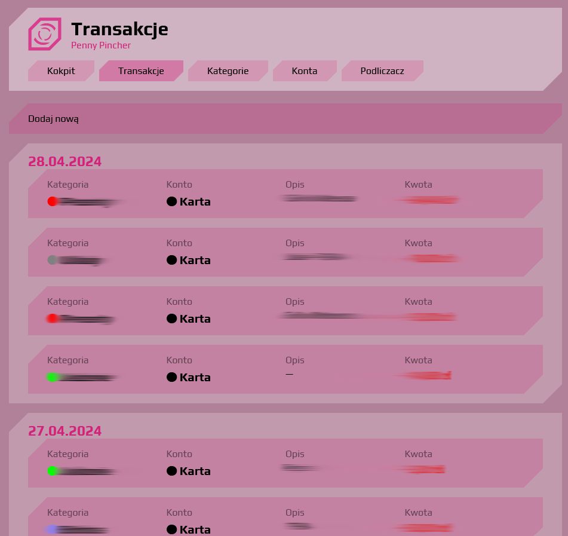
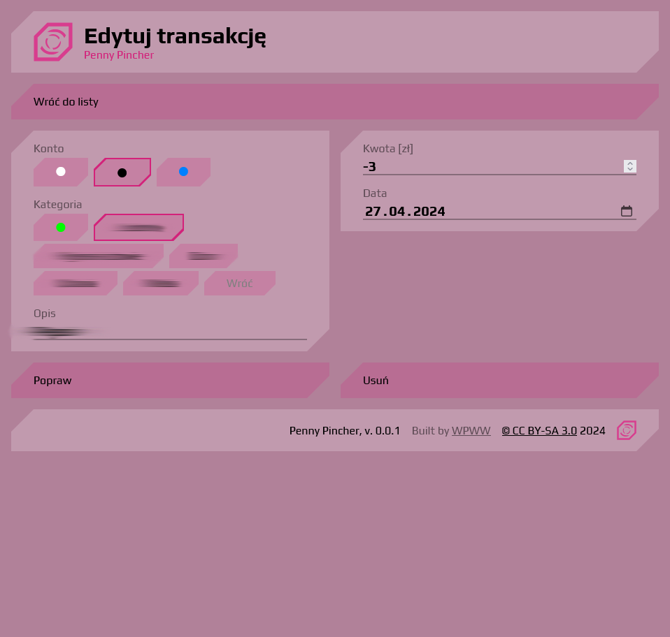
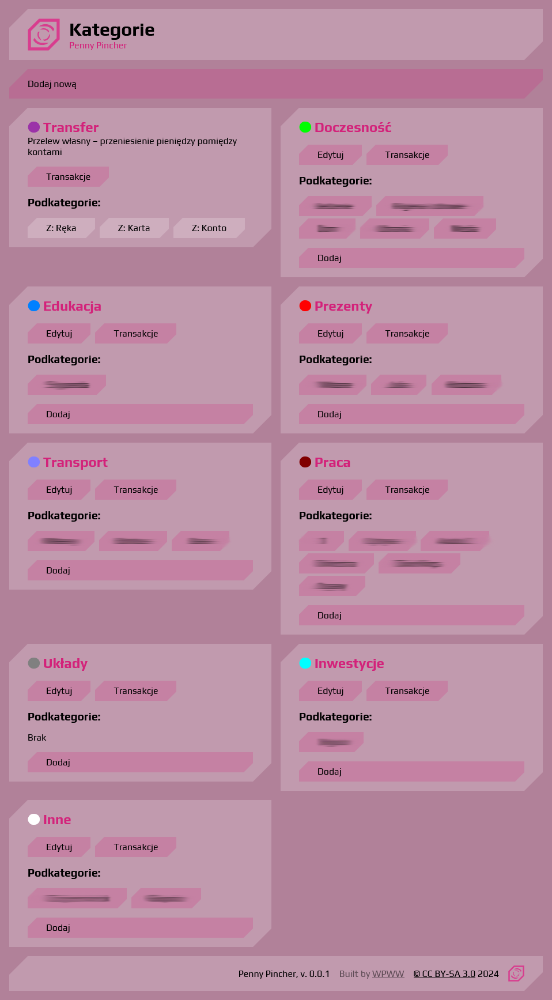
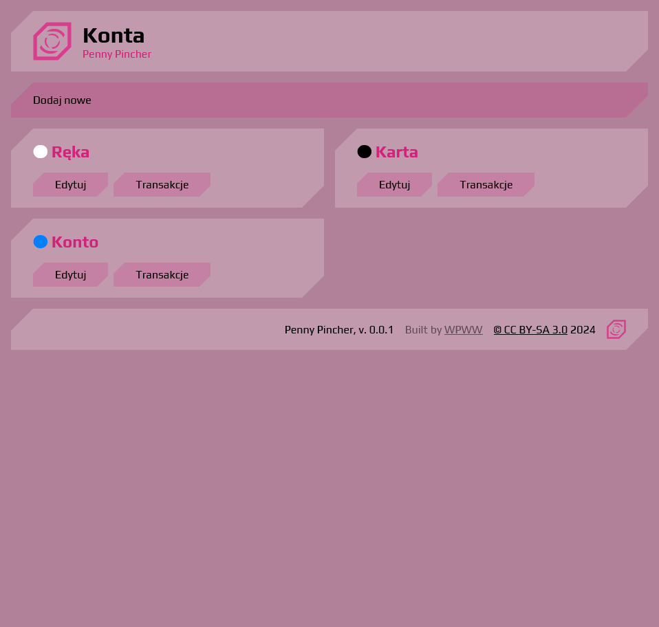
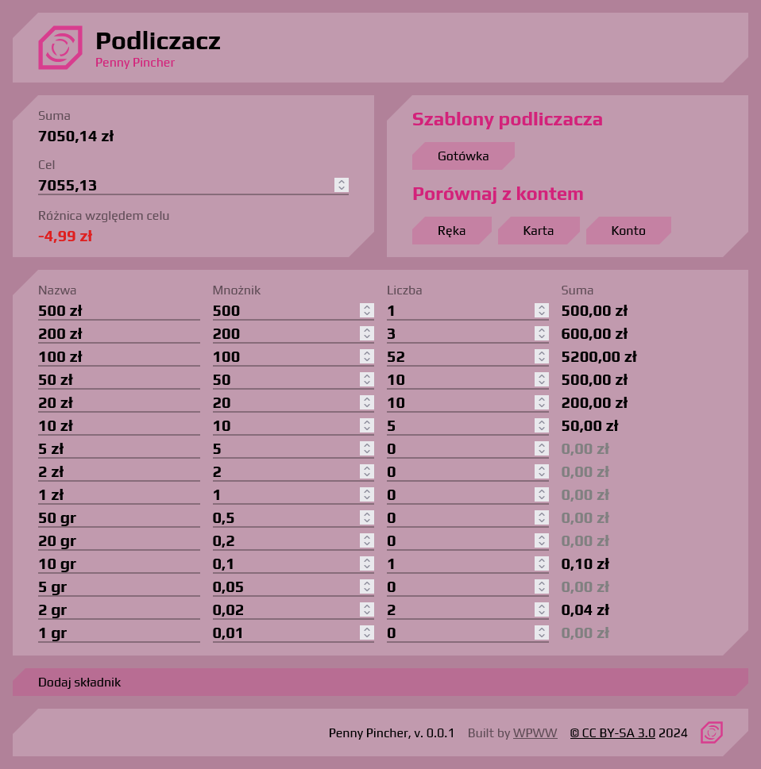

The Penny Pincher is designed to keep track of your finances.
It consists of multiple modules to help you categorize and log all your incomes and expenses.
It features powerful statistical module to give you a good look at a breakdown of your transactions.

## ⭐ What it can do
Currently the web app is capable of:
- 🗄️ categorizing your cash flow and accounts
- 🔧 custom categories and accounts
- 📝 tallying module for checking whether your balance is correct

Upcoming features:
- 📈 R-powered statistics and plots
- 📱 mobile application
- 📧 mail sniffer for automatic transaction import

## 🔧 Installation
### Local
1. Create your own `.env` file out of `.env.example` found in the root folder.
2. Build and run containers with `docker-compose up -d`.
3. The app will be running under http://localhost:3000/.

### Mobile app
🚧 

## 🖼️ Screenshots
The contents are subject to change.

